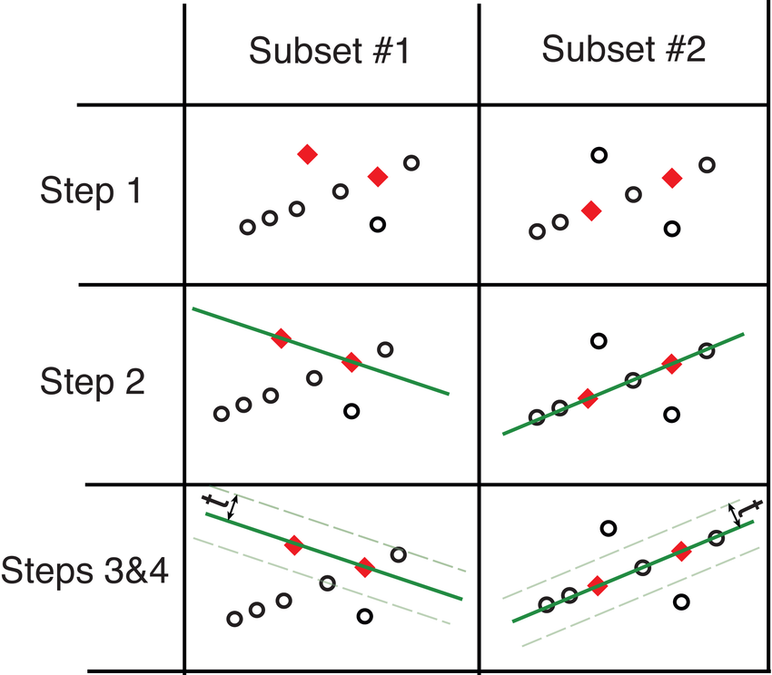

# Py_ngransac
Fundamental Matrix Estimation using Neural Guided RANSAC. **(In Python)** 

Paper Reference: [Neural-Guided RANSAC: Learning Where to Sample Model Hypotheses](https://arxiv.org/abs/1905.04132).

Original Git-Repo Reference: [vislearn/ngransac](https://github.com/vislearn/ngransac).

**This repo provides the implementation of the NG-RANSAC in Python as compared to the C++ implementation of the original repo.**

## Background

**What is [RANSAC](http://www.cs.ait.ac.th/~mdailey/cvreadings/Fischler-RANSAC.pdf)?**

Random Sample Consensus (RANSAC) is an iterative model for estimating a model from a dataset that contains outliers. It chooses sub-sets of data **randomly**. Each subset contains the minimum number of points (also called Minimal Set) to estimate the model hypothesis, and all the data points are asked to vote for the hypothesis (i.e. count the number of datapoints that lies within epsilon error of the estimated model hypothesis). The model hypothesis gets the most vote decides the inliers, and these inliers estimates the final model. 

In our case this model is **Fundamental Matrix**. 

The working of the RANSAC is depicted in the below figure.

* Step-1: Hypothesis Selection
* Step-2: Model Fitting using Hypothesis
* Step-3: Inlier/Outlier Selection

In **NG-RANSAC**,  Each datapoint is assigned a weight, these weights are calculated using the (pretrained) neural net. Instead of choosing the hypothesis randomly (like in RANSAC), **The minimal set in each hypothesis is guided by these weights**, hence the name Neural Guided RANSAC.
